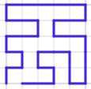

# grid-paths



## A C++ program to count Hamiltonian paths in the grid

A grid is a rectangular array of points connected vertically and horizontally. A Hamiltonian path in the grid is a path that touches each point exactly once.

This program counts the number of Hamiltonian paths in a grid of *m x n* points, starting at the bottom-left corner of the grid, with different ending points:

1. *A(m,n)* (adjacent paths) - paths that end at the bottom-right corner
2. *O(m,n)* (opposite paths) - paths that end at the top-right corner
3. *T(m,n)* (total paths) - ending anywhere

As the user computes values, results are appended in CSV tables in the "tables" folder. For example here is the adjacent path count table for *m, n <= 7*:


## How to build

To rebuild "main.exe", you need to compile "main.cpp". If you're using [mingw-w64](http://mingw-w64.org/doku.php) on Windows, with the g++ compiler, just enter:

```g++ -g main.cpp -o main.exe```

## How to use

Run ```main.exe``` and enter the number of rows (*m*) and columns (*n*) in the graph. The program will compute the counts of Adjacent, Opposite, and Total paths, print the counts, and save them in CSV files in the "tables" folder.